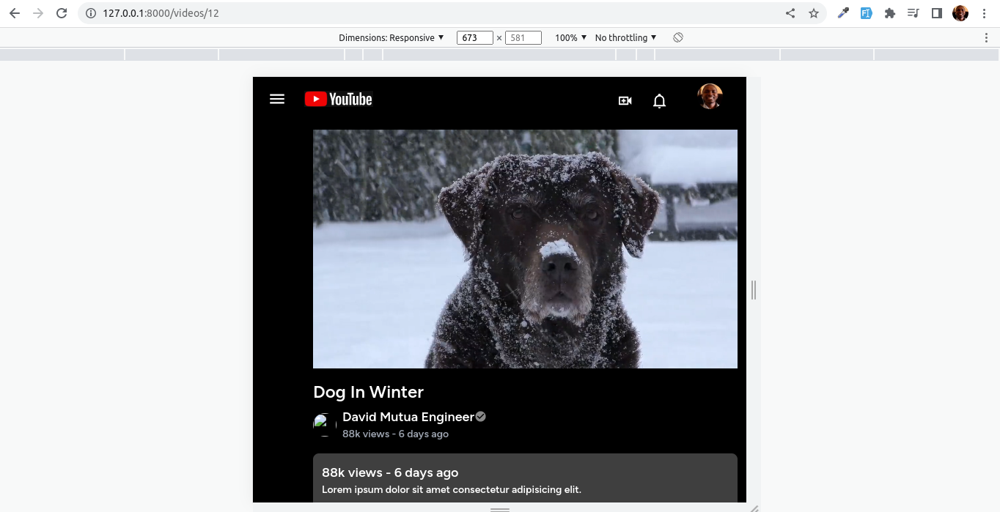

### Built with Laravel, Vue, TailwindCSS

  
  &nbsp&nbsp&nbsp&nbsp&nbsp&nbsp&nbsp&nbsp&nbsp&nbsp&nbsp&nbsp&nbsp&nbsp&nbsp&nbsp
  
  &nbsp&nbsp&nbsp&nbsp&nbsp&nbsp&nbsp&nbsp&nbsp&nbsp&nbsp&nbsp&nbsp&nbsp&nbsp&nbsp
  

Disclaimer: For the video it exceeds github limits to play here. Click and download it to watch.

1. Home Page

2. Video Details

3. Video Comments

4. Responsive Mobile

4. Responsive Medium

4. Responsive Laptops

4. Responsive Large Screens

